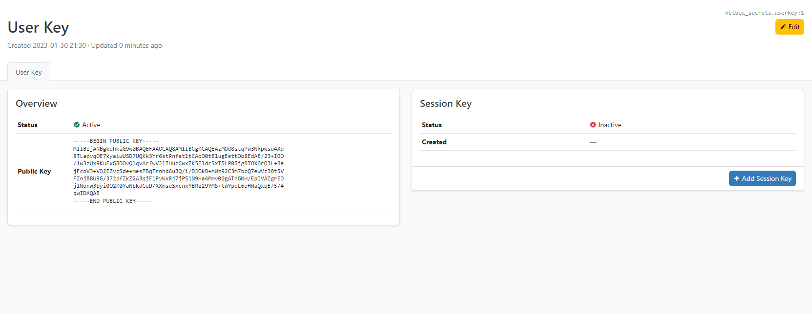
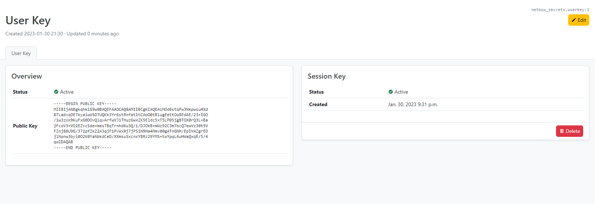
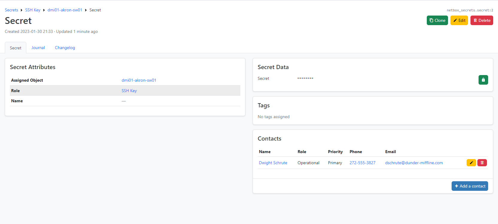
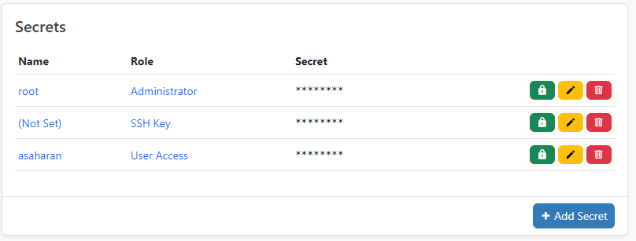

# Netbox Secrets

This is the continuation of the [NetBox Secretstore](https://github.com/DanSheps/netbox-secretstore) app. The original plugin
is minimally maintained and has a lot of issues. This plugin is a complete rewrite of the original plugin. It is more generic
and flexible than the original plugin. It is also regularly tested with the latest NetBox releases to ensure compatibility
and stability.

## Table of Contents

* [Features](#features)
* [Compatibility](#compatibility)
* [Installation](#installation)
* [Configuration](#configuration)
* [Extra Configuration](#extra-configuration)
* [Usage](#usage)
  * [User Keys](#user-keys)
    * [Supported Key Format](#supported-key-format)
    * [Creating the First User Key](#creating-the-first-user-key)
    * [Creating Additional User Keys](#creating-additional-user-keys)
  * [Secret Roles](#secret-roles)
  * [Secrets](#secrets)
* [API](#api)
  * [Generating a Session Key](#generating-a-session-key)
  * [Depracated Endpoint](#depracated-endpoint)
  * [Retrieving Secrets](#retrieving-secrets)
  * [Creating and Updating Secrets](#creating-and-updating-secrets)
* [Pynetbox](#pynetbox)
  * [Generating RSA Key Pair](#generating-rsa-key-pair)
  * [Activating User Key](#activating-user-key)
  * [Generating Session Key](#generating-session-key)
  * [Retrieving Session Key](#retrieving-session-key)
  * [Creating Secrets](#creating-secrets)
  * [Retrieving Secrets](#retrieving-secrets)
  * [Updating Secrets](#updating-secrets)
* [User Keys](#user-keys)
* [Screenshots](#screenshots)
* [FAQ](#faq)

## Features

* Store secrets in the database encrypted with a public key (RSA)
* More generic and flexible than the original plugin (e.g. secrets can be assigned to any object in NetBox)
* Secrets can be assigned to contacts to associate them with a secret (e.g. SSH key)
* Updated user interface to make it easier to use and more intuitive to navigate
* Regularly tested with the latest NetBox releases to ensure compatibility and stability

## Compatibility

| NetBox Version | Plugin Version |
|----------------|----------------|
| 3.3.x          | 1.4.x, 1.5.x   |
| 3.4.x          | 1.6.x, 1.7.x   |
| 3.5.x          | 1.8.x          |
| 3.6.x          | 1.9.x          |
| 3.7.x          | 1.10.x         |
| 4.0.x          | 2.0.x          |
| 4.1.x          | 2.1.x          |

## Installation

* Install NetBox as per NetBox documentation
* Add to local_requirements.txt:
  * `netbox-secrets`
* Install requirements: `./venv/bin/pip install -r local_requirements.txt`
* Add to PLUGINS in NetBox configuration:
  * `'netbox_secrets',`
* Run migration: `./venv/bin/python netbox/manage.py migrate`
* Run collectstatic: `./venv/bin/python netbox/manage.py collectstatic --no-input`

You can view releases at: [releases](https://github.com/Onemind-Services-LLC/netbox-secrets/releases)

## Configuration

The following options are available in the configuration file:

* `apps`
  * __Type__: `List`
  * __Description__: List of apps to enable
  * __Default__: `['dcim.device', 'virtualization.virtualmachine']`
* `display_default`
  * __Type__: `String`
  * __Description__: Where to display the secret on the detail page of the defined apps
  * __Default__: `left_page`
  * __Options__: `left_page`, `right_page`, `full_width_page`, `tab_view`
* `display_setting`
  * __Type__: `Dict`
  * __Description__: Set display setting for concrete model
  * __Default__: `{}`
  * __Options__: `{'app.model': 'display_default'}`
  * __Example__: `{'dcim.device': 'full_width_page', 'virtualization.virtualmachine': 'right_page'}`
* `enable_contacts`
  * __Type__: `Boolean`
  * __Description__: Enable contacts for secret
  * __Default__: `False`
* `public_key_size`
  * __Type__: `Integer`
  * __Description__: Size of the public key
  * __Default__: `2048`
  * __Options__: `2048`, `4096`, `8192`
* `top_level_menu`
  * __Type__: `Boolean`
  * __Description__: Enable top level menu
  * __Default__: `False`

## Extra Configuration

The following options are inherited from NetBox to configure the cookies:

* `SESSION_COOKIE_SECURE`
  * __Type__: `Boolean`
  * __Description__: [Session Cookie Secure](https://docs.netbox.dev/en/stable/configuration/security/#session_cookie_secure)
* `LOGIN_TIMEOUT`
  * __Type__: `Integer`
  * __Description__: [Login Timeout](https://docs.netbox.dev/en/stable/configuration/security/#login_timeout)

__Note: These options should be set in the NetBox configuration file.__

## Usage

### User Keys

Each user within NetBox can associate their account with an RSA public key. If activated by an administrator, this user key will contain a unique, encrypted copy of the AES master key needed to retrieve secret data.

User keys may be created by users individually, however they are of no use until they have been activated by a user who already possesses an active user key.

For more information on user keys, please refer to the [User Key](./docs/models/userkey.md) documentation.

#### Supported Key Format

Public key formats supported

* PKCS#1 RSAPublicKey* (PEM header: BEGIN RSA PUBLIC KEY)
* X.509 SubjectPublicKeyInfo** (PEM header: BEGIN PUBLIC KEY)
* __OpenSSH line format is not supported.__

Private key formats supported (unencrypted)

* PKCS#1 RSAPrivateKey** (PEM header: BEGIN RSA PRIVATE KEY)
* PKCS#8 PrivateKeyInfo* (PEM header: BEGIN PRIVATE KEY)

#### Creating the First User Key

When NetBox is first installed, it contains no encryption keys. Before it can store secrets, a user
(typically the superuser) must create a user key. This can be done by navigating to Netbox Secrets > User Key.

To create a user key, you can either generate a new RSA key pair, or upload the public key belonging to a pair you
already have. If generating a new key pair, __you must click on the `I Saved My New Private Key` button__ to properly save it.


Once your user key has been created, its public key will be displayed under your User Key page.

When the first user key is created in NetBox, a random master encryption key is generated automatically. This key is
then encrypted using the public key provided and stored as part of your user key. __The master key cannot be recovered__
without your private key.

Once a user key has been assigned an encrypted copy of the master key, it is considered activated and can now be used
to encrypt and decrypt secrets.

#### Creating Additional User Keys

Any user can create his or her user key by generating or uploading a public RSA key. However, a user key cannot be used
to encrypt or decrypt secrets until it has been activated with an encrypted copy of the master key.

Only an administrator with an active user key can activate other user keys. To do so, access the NetBox admin UI and
navigate to Admin > NetBox Secrets > User Keys. Select the user key(s) to be activated, and select
"activate selected user keys" from the action dropdown. You will need to provide your private key in order to decrypt
the master key. A copy of the master key is then encrypted using the public key associated with the user key being activated.

### Secret Roles

Each secret is assigned a functional role which indicates what it is used for. Secret roles are customizable.

Typical roles might include:

* Login credentials
* SNMP community strings
* RADIUS/TACACS+ keys
* IKE key strings
* Routing protocol shared secrets

### Secrets

A secret represents a single credential or other sensitive string of characters which must be stored securely. Each
secret is assigned to a device within NetBox. The plaintext value of a secret is encrypted to a ciphertext
immediately prior to storage within the database using a 256-bit AES master key. A SHA256 hash of the plaintext is also
stored along with each ciphertext to validate the decrypted plaintext.

Each secret can also store an optional name parameter, which is not encrypted. This may be useful for storing usernames.

## API

As with most other objects, the REST API can be used to view, create, modify, and delete secrets. However, additional
steps are needed to encrypt or decrypt secret data.

### Generating a Session Key

In order to encrypt or decrypt secret data, a session key must be attached to the API request. To generate a session key,
send an authenticated request to the `/api/plugins/secrets/session-keys/` endpoint with the private RSA key which
matches your [UserKey](../models/userkey.md). Place the private RSA key in a json file.

```no-highlight
$ curl -X POST http://netbox/api/plugins/secrets/session-keys/ \
-H "Authorization: Token $TOKEN" \
-H "Accept: application/json; indent=4" \
-H "Content-Type: application/json" \
--data @<filename>
```

```json
{
    "pk": 7,
    "id": 7,
    "url": "http://netbox/api/plugins/secrets/session-keys/7/",
    "display": "admin (RSA)",
    "userkey": {
        "id": 1,
        "url": "http://netbox/api/plugins/secrets/user-keys/1/",
        "display": "admin"
    },
    "session_key": "4H8MCOl98qom7Ug5fQTzsFcH600SRWxe7KlUyIYxJ+A=",
    "created": "2023-05-07T20:29:38.089884Z"
}
```

!!! note
    To read the private key from a file, use the convention above. Alternatively, the private key can be read from an
environment variable using `--data "{\"private_key\": \"$PRIVATEKEY\"}"`.

Use the following CLI command to convert your PEM RSA key to json:

```no-highlight
jq -sR . <filename>
```

The request uses the provided private key to unlock your stored copy of the master key and generate a temporary
session key, which can be attached in the `X-Session-Key` header of future API requests.

### Depracated Endpoint

If you still want to use `application/x-www-form-urlencoded` you can use the __depracated__ API endpoint
`http://netbox/api/plugins/secrets/get-session-key/`.

```no-highlight
curl -X POST https://netbox-test.tugraz.at/api/plugins/secrets/get-session-key/ \
-H "Authorization: Token $TOKEN" \
-H "Accept: application/json; indent=4" \
--data-urlencode "private_key@<filename>"
```

```json
{
    "session_key": "4H8MCOl98qom7Ug5fQTzsFcH600SRWxe7KlUyIYxJ+A="
}
```

### Retrieving Secrets

A session key is not needed to retrieve unencrypted secrets: The secret is returned like any normal object with its
`plaintext` field set to null.

```no-highlight
$ curl http://netbox/api/plugins/secrets/secrets/2587/ \
-H "Authorization: Token $TOKEN" \
-H "Accept: application/json; indent=4"
```

```json
{
    "id": 2587,
    "url": "http://netbox/api/plugins/secrets/secrets/2587/",
    "display": "admin",
    "assigned_object_type": "dcim.device",
    "assigned_object_id": 1827,
    "assigned_object": {
        "id": 1827,
        "url": "http://netbox/api/dcim/devices/1827/",
        "display": "MyTestDevice",
        "name": "MyTestDevice"
    },
    "role": {
        "id": 4,
        "url": "http://netbox/api/plugins/secrets/secret-roles/4/",
        "display": "Login Credentials",
        "name": "Login Credentials",
        "slug": "login-creds"
    },
    "name": "admin",
    "plaintext": null,
    "hash": "pbkdf2_sha256$1000$G6mMFe4FetZQ$f+0itZbAoUqW5pd8+NH8W5rdp/2QNLIBb+LGdt4OSKA=",
    "tags": [],
    "custom_fields": {},
    "created": "2022-12-30T21:25:17.335575Z",
    "last_updated": "2022-12-30T21:25:17.335619Z"
}
```

To decrypt a secret, we must include our session key in the `X-Session-Key` header when sending the `GET` request:

```no-highlight
$ curl http://netbox/api/plugins/secrets/secrets/2587/ \
-H "Authorization: Token $TOKEN" \
-H "Accept: application/json; indent=4" \
-H "X-Session-Key: dyEnxlc9lnGzaOAV1dV/xqYPV63njIbdZYOgnAlGPHk="
```

```json
{
    "id": 2587,
    "url": "http://netbox/api/plugins/secrets/secrets/2587/",
    "display": "admin",
    "assigned_object_type": "dcim.device",
    "assigned_object_id": 1827,
    "assigned_object": {
        "id": 1827,
        "url": "http://netbox/api/dcim/devices/1827/",
        "display": "MyTestDevice",
        "name": "MyTestDevice"
    },
    "role": {
        "id": 4,
        "url": "http://netbox/api/plugins/secrets/secret-roles/4/",
        "display": "Login Credentials",
        "name": "Login Credentials",
        "slug": "login-creds"
    },
    "name": "admin",
    "plaintext": null,
    "hash": "pbkdf2_sha256$1000$G6mMFe4FetZQ$f+0itZbAoUqW5pd8+NH8W5rdp/2QNLIBb+LGdt4OSKA=",
    "tags": [],
    "custom_fields": {},
    "created": "2022-12-30T21:25:17.335575Z",
    "last_updated": "2022-12-30T21:25:17.335619Z"
}
```

Multiple secrets within a list can be decrypted in this manner as well:

```no-highlight
$ curl http://netbox/api/plugins/secrets/secrets/?limit=3 \
-H "Authorization: Token $TOKEN" \
-H "Accept: application/json; indent=4" \
-H "X-Session-Key: dyEnxlc9lnGzaOAV1dV/xqYPV63njIbdZYOgnAlGPHk="
```

```json
{
    "count": 3482,
    "next": "http://netbox/api/plugins/secrets/secrets/?limit=3&offset=3",
    "previous": null,
    "results": [
        {
            "id": 2587,
            "plaintext": "foobar",
            ...
        },
        {
            "id": 2588,
            "plaintext": "MyP@ssw0rd!",
            ...
        },
        {
            "id": 2589,
            "plaintext": "AnotherSecret!",
            ...
        },
    ]
}
```

To get a list of secrets from the assigned object

```no-highlight
$ curl http://netbox/api/plugins/secrets/secrets/?assigned_object_type=dcim.device&assigned_object_id=103 \
-H "Authorization: Token $TOKEN" \
-H "Accept: application/json; indent=4" \
-H "X-Session-Key: dyEnxlc9lnGzaOAV1dV/xqYPV63njIbdZYOgnAlGPHk="
```

```json
{
    "count": 2,
    "next": "http://netbox/api/plugins/secrets/secrets/?limit=3&offset=3",
    "previous": null,
    "results": [...]
}
```

### Creating and Updating Secrets

Session keys are required when creating or modifying secrets. The secret's `plaintext` attribute is set to its
non-encrypted value, and NetBox uses the session key to compute and store the encrypted value.

```no-highlight
$ curl -X POST http://netbox/api/secrets/secrets/ \
-H "Content-Type: application/json" \
-H "Authorization: Token $TOKEN" \
-H "Accept: application/json; indent=4" \
-H "X-Session-Key: dyEnxlc9lnGzaOAV1dV/xqYPV63njIbdZYOgnAlGPHk=" \
--data '{"assigned_object_id": 1827, "assigned_object_type": "dcim.device", "role": 1, "name": "backup", "plaintext": "Drowssap1"}'
```

```json
{
    "id": 6194,
    "url": "http://netbox/api/plugins/secrets/secrets/9194/",
    "display": "admin",
    "assigned_object_type": "dcim.device",
    "assigned_object_id": 1827,
    "assigned_object": {
        "id": 1827,
        "url": "http://netbox/api/dcim/devices/1827/",
        "display": "device43",
        "name": "device43"
    },
    "role": {
        "id": 4,
        "url": "http://netbox/api/plugins/secrets/secret-roles/4/",
        "display": "Login Credentials",
        "name": "Login Credentials",
        "slug": "login-creds"
    },
    "name": "admin",
    "plaintext": null,
    "hash": "pbkdf2_sha256$1000$J9db8sI5vBrd$IK6nFXnFl+K+nR5/KY8RSDxU1skYL8G69T5N3jZxM7c=",
    "tags": [],
    "custom_fields": {},
    "created": "2022-12-30T21:25:17.335575Z",
    "last_updated": "2022-12-30T21:25:17.335619Z"
}
```

!!! note
    Don't forget to include the `Content-Type: application/json` header when making a POST or PATCH request.

## Pynetbox

The `pynetbox` library can be used to interact with the NetBox API as well. Here are some examples of how to use `pynetbox` to interact with the NetBox Secrets plugin.

### Generating RSA Key Pair

### Activating User Key

### Generating Session Key

### Retrieving Session Key

### Creating Secrets

### Retrieving Secrets

### Updating Secrets

## Screenshots

### User key (Without Session)



### User key (With Session)



### Secret Object View



### Secret Panel on Device



### Secret Role Object View


## FAQ

1. How can I migrate the data from `netbox-secretstore`?

_Note: This is a one-way migration. You can't migrate back to `netbox-secretstore`. Ensure you do not have any data including tables for netbox-secrets already in the database_

These instructions assume that you are running Netbox v3.4.x and the plugin version 1.7.x. Install a new version
of `netbox_secretstore` as:

```shell
pip install git+https://github.com/Onemind-Services-LLC/netbox-secretstore@migration/nb34
```

_Note: You should have netbox-secretstore v1.4.4 installed now._

Make sure to add both plugins to the `configuration.py` before the migration.

Run the migration:

```shell
python manage.py migrate
```

Finally, readjust the indices for the `netbox-secrets` plugin

```shell
python manage.py sqlsequencereset netbox_secrets
```

Run the output of the previous command in the database.

You can now remove `netbox-secretstore` from the application. You may have clean up your database of the old tables manually.
