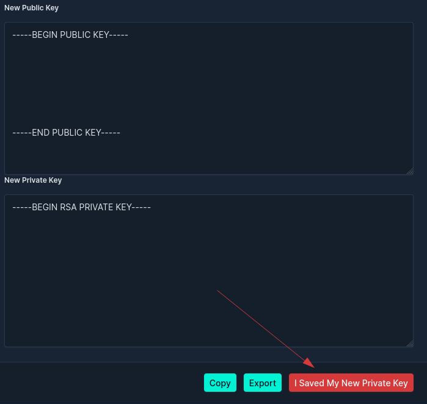

# User Keys

Each user within NetBox can associate his or her account with an RSA public key. If activated by an administrator,
this user key will contain a unique, encrypted copy of the AES master key needed to retrieve secret data.

User keys may be created by users individually, however they are of no use until they have been activated by a user
who already possesses an active user key.

## Supported Key Format

Public key formats supported

- PKCS#1 RSAPublicKey* (PEM header: BEGIN RSA PUBLIC KEY)
- X.509 SubjectPublicKeyInfo** (PEM header: BEGIN PUBLIC KEY)
- **OpenSSH line format is not supported.**

Private key formats supported (unencrypted)

- PKCS#1 RSAPrivateKey** (PEM header: BEGIN RSA PRIVATE KEY)
- PKCS#8 PrivateKeyInfo* (PEM header: BEGIN PRIVATE KEY)

## Creating the First User Key

When NetBox is first installed, it contains no encryption keys. Before it can store secrets, a user
(typically the superuser) must create a user key. This can be done by navigating to Netbox Secrets > User Key.

To create a user key, you can either generate a new RSA key pair, or upload the public key belonging to a pair you
already have. If generating a new key pair, **you must click on the `I Saved My New Private Key` button** to properly save it.

Once your user key has been created, its public key will be displayed under your User Key page.

When the first user key is created in NetBox, a random master encryption key is generated automatically. This key is
then encrypted using the public key provided and stored as part of your user key. **The master key cannot be recovered**
without your private key.

Once a user key has been assigned an encrypted copy of the master key, it is considered activated and can now be used
to encrypt and decrypt secrets.

## Creating Additional User Keys

Any user can create his or her user key by generating or uploading a public RSA key. However, a user key cannot be used
to encrypt or decrypt secrets until it has been activated with an encrypted copy of the master key.

Only an administrator with an active user key can activate other user keys. To do so, access the NetBox admin UI and
navigate to Admin > NetBox Secrets > User Keys. Select the user key(s) to be activated, and select
"activate selected user keys" from the action dropdown. You will need to provide your private key in order to decrypt
the master key. A copy of the master key is then encrypted using the public key associated with the user key being activated.
